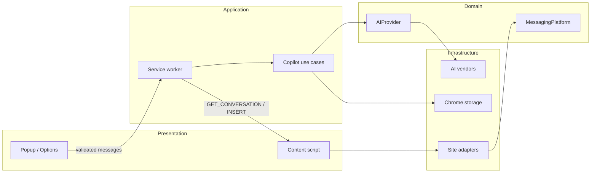

# ReplyMe

AI communication copilot for the sites you already write in.

ReplyMe is a Manifest V3 Chrome extension that reads the open conversation, generates several reply styles, and inserts the one you want. It is built as a **plugin system**: messaging sites and AI vendors are folders, not `switch` statements.

Live UI preview (no Chrome profile required) uses the Mock provider and a sample Gmail thread.

## Overview

Open a thread on Gmail, Google Messages, WhatsApp Web, Messenger, Discord, Slack, LinkedIn, or X. Open ReplyMe (`Ctrl+Shift+Y` / `⌘⇧Y`). Generate Professional, Friendly, Casual, Funny, Empathetic, Short, Long, or Assertive replies. Copy or insert. Summarize the thread (saved as conversation memory). Rewrite, translate, shorten, expand, fix grammar, change tone, explain, or ask for follow-ups and icebreakers.

API keys never leave the service worker. Content scripts only extract and insert text.

## Architecture



Design decisions live in [ARCHITECTURE.md](./ARCHITECTURE.md).

Layers:

| Layer | Folders | Rule |
| --- | --- | --- |
| Presentation | `popup/`, `options/`, `components/`, `hooks/`, `content/` | No HTTP, no secrets |
| Application | `services/`, `background/` | Orchestrates use cases |
| Domain | `types/`, `models/`, `constants/` | No React, no Chrome |
| Infrastructure | `adapters/`, `ai/`, `storage/` | Plugins + I/O |

Adding a website: create `src/adapters/<id>/` with `meta.json` + `MessagingPlatform`. The glob registry and the extension manifest pick it up. No existing TypeScript file needs to change.

Adding an AI vendor: create `src/ai/providers/<id>/` implementing `AIProvider`. Same glob discovery.

## Folder structure

```
src/
  adapters/          # Gmail, WhatsApp, Discord, Slack, LinkedIn, Messenger, X, Google Messages
  ai/                # OpenAI-compatible base, Gemini, Claude, Mock, registry
  background/        # MV3 service worker
  content/           # Host-page adapter host
  components/        # Shared UI
  popup/             # Extension popup
  options/           # Settings
  services/          # Generate, summarize, rewrite, follow-ups
  storage/           # Settings, secrets, memory, cache
  hooks/
  models/
  types/
  constants/
  utils/
  preview/           # Hosted demo runtime (mock chrome)
```

## Features

**Core**
- Detect the open conversation
- Extract recent messages
- Generate multiple reply styles
- Copy / insert / regenerate
- Loading skeletons, empty and error states

**Copilot**
- Conversation summarization + memory
- Smart follow-ups
- Grammar, rewrite, translate, tone, shorten, expand, explain
- Icebreakers

**Settings**
- Provider, model, temperature, response length, default tone, theme
- Keyboard shortcut documented (Chrome commands)
- API keys in `chrome.storage.local` only

**Providers**
- OpenAI (default real vendor)
- Gemini, Claude, OpenRouter, DeepSeek, local Ollama
- Mock (offline demo)

## Installation

### Load the unpacked extension

```bash
npm install
npm run build
```

1. Open `chrome://extensions`
2. Enable Developer mode
3. Load unpacked → select the `dist/` folder
4. Pin ReplyMe. Open a Gmail thread and press `Ctrl+Shift+Y`

### Preview the UI without Chrome

```bash
npm install
npm run dev
```

Opens the popup inside a desktop shell at `http://127.0.0.1:43127`. Mock provider is on by default.

## Development

```bash
npm run dev            # hosted preview (Vite)
npm run build          # MV3 bundle → dist/
npm run typecheck
npm test
npm run lint
```

TypeScript is strict. Adapters fail closed when a site DOM shifts. Insert uses native value setters so React composers accept the text.

## Screenshots

The hosted preview is the source of truth for UI:

- Popup: generate, copy, insert, regenerate
- Tools: rewrite / grammar / translate / follow-ups
- Settings: provider, model, temperature, theme

See `docs/screenshots/` after running the preview (or the live Preview card in this workspace).

## Roadmap

- [ ] Per-site selector health checks with a silent fallback UI
- [ ] Side-panel as the default surface instead of the popup
- [ ] Shared selector snapshots in CI against public web-app shells
- [ ] Streaming tokens into reply cards
- [ ] Team prompt library (sync-optional)

## Contributing

1. Keep layers separate. UI does not call `fetch` on an AI vendor.
2. New site = new adapter folder. Do not edit `registry.ts`.
3. New vendor = new provider folder. Prefer `OpenAICompatibleProvider` if the HTTP shape matches.
4. Every extension message stays in the Zod union in `src/types/messages.ts`.
5. `npm run typecheck` and `npm test` before you push.

## Future ideas

- On-device models via Chrome's built-in Prompt API when available
- Calendar-aware replies (busy/free, no invented meetings)
- Shared adapter test fixtures recorded from real threads (opt-in)
- Firefox port using the same domain layer

## License

MIT
